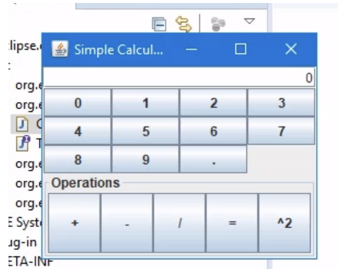
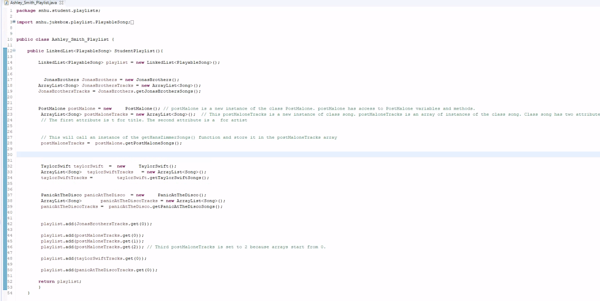
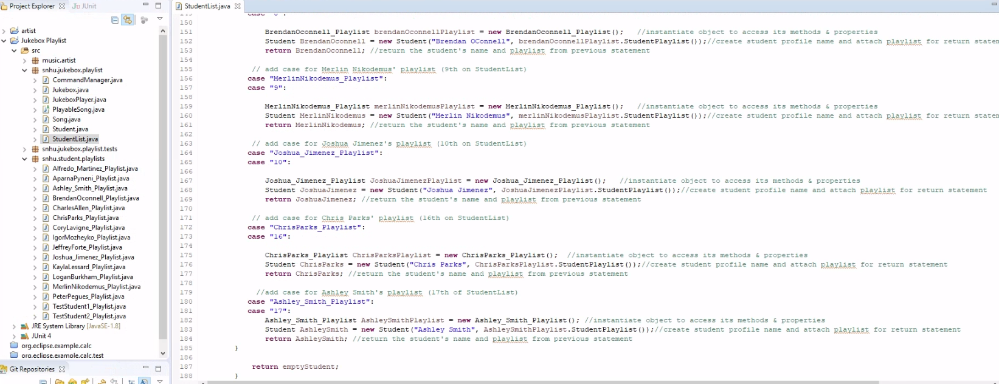

# **CS-499 ePortfolio**

## **Introduction**

Hello my name is Ashley Smith, and I started attending SNHU's 
computer science seven years ago. This gitHub pages account is meant 
to provide an electronic portfolio from which I finishmy final 
project for CS-499 and compelete my Bachelor's degree in computer science.  

----------------------------------------------------------------------------------------------------------------------------------------------------------------------------------------------

## **Artifacts**
The artifacts presented for the portfolio are introductions to my work for software design and 
engineering, algorithms and data structures, and databases.  Through the course of the class, I 
have improved my artifacts software, expanded their complexity, and added comments to make their code
easier to read.
    
## **Informal Code Review**

[Code Review Youtube Link](https://youtu.be/m5RE7gRhwb4)

----------------------------------------------------------------------------------------------------------------------------------------------------------------------------------------------

## **Enhancement One: Software Design and Engineering**
### Introduction:

The artifact for the software design and engineering category is my final project from CS-310 that I completed in March 2025.  It is a calculator application that is used to help complete some basic math problems.  

 

**Click here to view the full narrative** \| [(View Narrative)](https://github.com/ashleysmith22/ePortfolio/blob/main/Narratives/Milestones/3-2%20Milestone%20Two_%20Enhancement%20One_%20Software%20Design%20and%20Engineering.pdf)

    
<em>Figure 1 - Calculator, Ashley Smith playlist - CS-310, Collaboration and Team Project </em>

  

### **Repository Link**

- [Enhancement One Repository](https://github.com/ashleysmith22/EnhancementOne-Software-Design-and-Engineering)

### Conclusion:

This item was selected because it is a good example of testing data. When bulding the project, I added to multiplication, division and power classes. I was able to test each code with jUnit to make sure they werre working properly before submission. The artifact is improved by adding new the new classes to function easier. 
 

----------------------------------------------------------------------------------------------------------------------------------------------------------------------------------------------

## **Enhancement Two: Algorithms and Data Structures**
### Introduction:

The artifact I am using for my enhancement two is the Jukebox application from my CS 310 class. It is a collaboration of musical artists, songs, playlists from myself and classmates. This was created originally by my professor in 2020 I believe, but students have added to it each class he has taught.

I picked this artifact because it was something I enjoyed adding to/making in my CS 310 class. The components for this artifact showcase team collaboration, it showcases the organization of the albums, playlists and musical artists just like playing music on Spotify or Pandora. The artifact has improved by adding my own choice in music and my own playlist. It helps store everyone's songs, playlists and artists throughout the project. 

My goal was to be able to add my own playlist, songs and artists. I wanted to add my own songs and pick some of my favorite artists. I spent half a day working on this project and struggled a lot when I first began. After many hours, I was able to successfully add my own playlist.

**Click here to view the full narrative** \| [(View Narrative)](https://github.com/ashleysmith22/ePortfolio/blob/main/Narratives/Milestones/4-2%20Milestone%20Three_%20Enhancement%20Two_%20Algorithms%20and%20Data%20Structure.pdf)

    
<em>Figure 2 - Jukebox, Ashley Smith playlist - CS-310, Collaboration and Team Project </em>

  

### **Repository Link**

- [Enhancement Two Repository](https://github.com/ashleysmith22/EnhancementTwo-Algorithms-and-Data-Structure)

### Conclusion:

  
I tried this project 6 different times on 3 different computers. I struggled a lot beginning this project. I spent half a day trying to figure out where I was going wrong and finally, at 11 pm, I got my project to finally do what was needed. I was able to add my songs, collaborate with my team and add my own playlist. When I first added my own student profile to link to my own playlist, I was unable to link my login information to my playlist. I realized when I entered my profile information, it was linking to another student. I had set my profile number to the other students instead of creating a new profile login number. After I corrected this, my whole program ran correctly.

----------------------------------------------------------------------------------------------------------------------------------------------------------------------------------------------

## **Enhancement Three: Databases**
### Introduction:

The artifact used for the databases category is a project from CS-310 that was completed in March of 2025.  It is a java file that was designed to collaborate with my classmates to each create theirown musical playlists. Each studet were given the instructions to add our own songs, login's and album choices.

This project was selected as my third artifact because it is an excellent example of how databases are constructed at the back end.  I picked this artifact because it was something I enjoyed adding to/making in my CS 310 class. The components for this artifact showcase team collaboration, it showcases the organization of the albums, playlists and musical artists just like playing music on Spotify or Pandora. The artifact has improved by adding my own choice in music and my own playlist. It helps store everyone's songs, playlists and artists throughout the project. 

**Click here to view the full narrative** \| [(View Narrative)](https://github.com/ashleysmith22/ePortfolio/blob/main/Narratives/Milestones/5-2%20Milestone%20Four_%20Enhancement%20Three_%20Databases.pdf)

    
<em>Figure 3 - Jukebox - CS-310, Collaboration and Team Project </em>

### **Repository Link**

- [Enhancement Three Repository](https://github.com/ashleysmith22/Enhancement-Three-Databases)
### Conclusion:

When I was enhancing my project, I learned to add my own songs, albums and create different logins for each person'sown playlist. I tried this project 6 different times on 3 different computers. I struggled a lot beginning this project. I spent half a day trying to figure out where I was going wrong and finally, at 11 pm, I got my project to finally do what was needed. I was able to add my songs, collaborate with my team and add my own playlist. When I first added my own student profile to link to my own playlist, I was unable to link my login information to my playlist. I realized when I entered my profile information, it was linking to another student. I had set my profile number to the other students instead of creating a new profile login number. After I corrected this, my whole program ran correctly. 

----------------------------------------------------------------------------------------------------------------------------------------------------------------------------------------------

## **Professional Self-Assessment**

Reflecting on my experience in the Computer Science program and in completing my capstone project, I am grateful for all the learning, skills, and growth I have accomplished. Not only did the program give me a strong foundation in technical subjects like algorithms, data structures, and software development, I have also developed meaningful experience in solving complex problems, critical thinking, and communicating solutions to users and clients. My capstone project, in particular, allowed me to employ the skills in my own classroom.

I have developed from the program to a real-world project where I designed and implemented a software solution to a defined problem. Completing the capstone progressed my technical capabilities but it was also a great opportunity to grow my project management, teamwork, and problem-solving skills.Through my studies, I have cultivated competencies in several programming languages including Python, Java, and C, and I have utilized many different tools and technologies including version control, cloud computing environments, and databases.

Most importantly, I have developed a deeper understanding of the best practices in designing and building maintainable and scalable systems that satisfy user use cases and business requirements. As I am still fairly entering new into teaching, I plan to incorporate coding into a robotics club and help teach students some basic knowledge of coding that is vastly growing in the world today. 

### **GitHub Pages Link**

- [CS-499 ePortfolio](https://ashleysmith22.github.io/)
